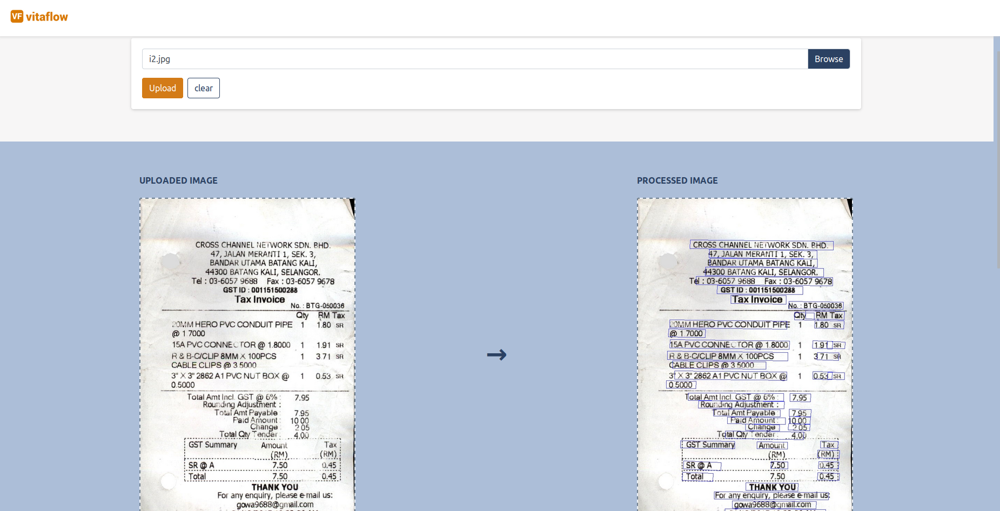
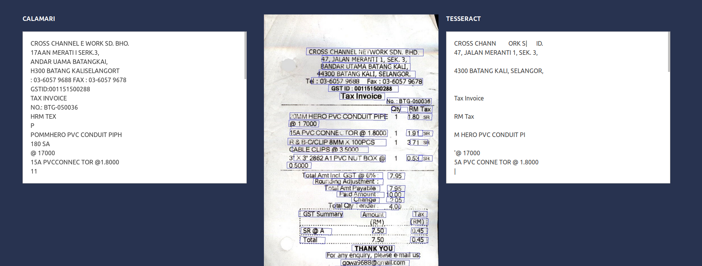

[](https://github.com/imaginea/vitaflow/blob/master/LICENSE)


# VitaFlow - VideoImageTextAudioFlow
 

## [Introduction](what_is_vitaflow.md)

## Environment Setup

**Ubuntu Specific Installation**
- https://www.tensorflow.org/tfx/serving/setup
- `sudo apt-get -y install postgresql postgresql-contrib libpq-dev postgresql-client postgresql-client-common`
- Tesseract
    ```
       sudo add-apt-repository ppa:alex-p/tesseract-ocr 
       sudo apt-get update
       sudo apt install libtesseract-dev libleptonica-dev liblept5
       sudo apt install tesseract -y
  
       tesseract iamge.jpg out_text -l eng --oem 1 --psm 3
    ```
  
    - https://launchpad.net/~alex-p/+archive/ubuntu/tesseract-ocr
    - 

**Python Setup**

```
   git clone https://github.com/Imaginea/vitaFlow/
   cd vitaFlow/
   conda create -n vf python=3.5
   conda activate vf
   export SLUGIFY_USES_TEXT_UNIDECODE=yes
   pip install -r requirements.txt
```


---------------------------------------------------------------------------------------------------------

## Demo  
We have put up a small working demo, which basically can read text from camera images. (Note: the models are not tweaked for the maximum performance)   

The pipeline components includes:   
 - EAST Model
 - Image Binarization 
 - Cropping module (crops each text line from the image as single image)
 - OCR with Tesseract and DL based OCR called Calamari  (image to text for all the images that were generated from previous cropper stage)
 - Text stiching (where each text out from the images are stiched as one text file)
 
### Local machine

**Python Script**  

- Input Files Directory : [data/receipts/](data/receipts/)
- output  Files Directory : [data/text_out/](data/text_out/)
  - X51008142068_**CalamariOcrModule**.txt : **Output using our pipeline**
  - X51008142068_**TessaractOcrModule**.txt : **Ouput using PyTesseract**
  
```
python vitaflow/bin/vf-ocr.py --image_dir=data/receipts/ --out_dir=data/text_out/
```

**Web UI**

```
cd django_apis/apis/
python manage.py runserver 0.0.0.0:9000
```


```
cd ui
vim .env #add below line
    REACT_APP_VITAFLOW_APIURL = http://localhost:9000
npm install
npm install csstools/normalize.css
npm start
```

UI : http://localhost:3000/






**Text Annotator**
```
cd third_party_apps/text_annotate_server/
./install.sh -u
place data in data folder which is created in same directory by above script.
conda create -n brat python=2.7
pip install filelock
python2 standalone.py
```

UI : http://localhost:8001

```shell script
cd annotation_tools
for f in *.txt; do touch "${f%.}.ann"; done
```