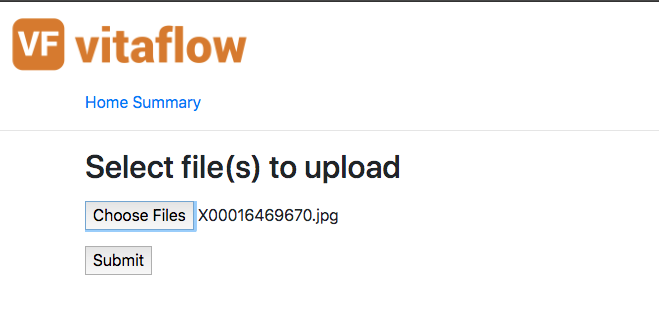
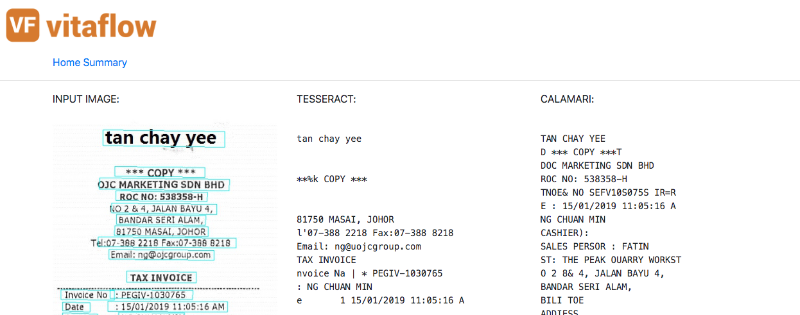

[](https://github.com/imaginea/vitaflow/blob/master/LICENSE)


# VitaFlow - VideoImageTextAudioFlow
 

## Environment Setup

**Python Setup**

```
conda create -n vf python=3.5
conda activate vf
export SLUGIFY_USES_TEXT_UNIDECODE=yes
pip install -r requirements.txt
```

**Ubuntu Setup**
- https://www.tensorflow.org/tfx/serving/setup

---------------------------------------------------------------------------------------------------------

## Demo  
We have put up a small working demo, which basically can read text from camera images. (Note: the models are not tweaked for the maximum performance)   

The pipeline components includes:   
 - EAST Model
 - Image Binarization 
 - Cropping tool (crops each text line from the image as single image)
 - OCR with Tesseract and DL based OCR called Calamari  (image to text for all the images that were generated from previous cropper stage)
 - Text stiching (where each text out from the images are stiched as one text file)
 
### Local machine

**MakeFile**  

- Input Files Directory : [data/receipts/](data/receipts/)
- output  Files Directory : [data/text_out/](data/text_out/)
  - X51008142068_**CalamariOcrPlugin**.txt : **Output using our pipeline**
  - X51008142068_**TessaractOcrPlugin**.txt : **Ouput using PyTesseract**
  
```
make east_ocr_pipeline
```

**Web UI**
```
cd path/to/vitaflow/
cd vitaflow/annotate_server/
python ./demo.py
```
Access the Web UI @ http://127.0.0.1:5000/

Home Page UI:



Sample out of a Image:




**Airflow**
- TODO

### Docker

---------------------------------------------------------------------------------------------------------

## Developers
How to tune EAST model and Calamari model for better OCR.

## Training

### EAST
- TODO

### Calamari
- TODO

# Disclaimer : VitaFlow is in it's infant stage! Review and feedbacks are welcomed!
