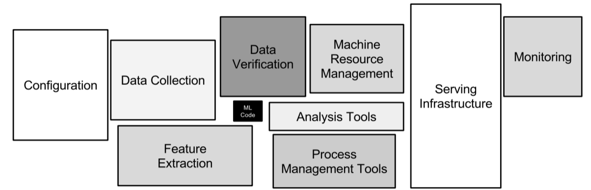
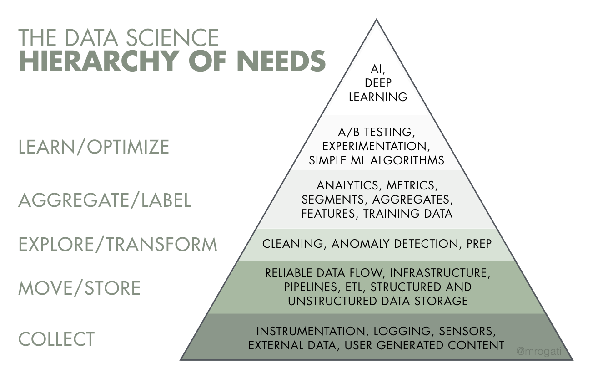
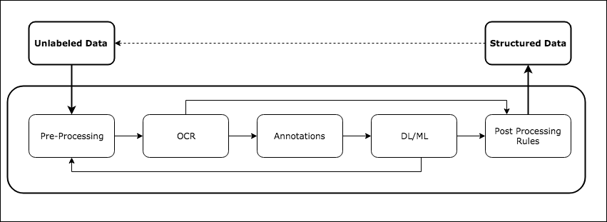
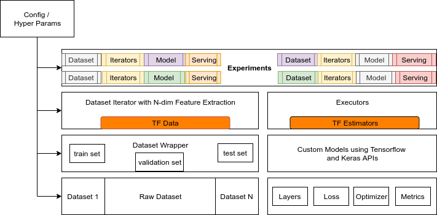

[](https://vitaflow.readthedocs.io/en/latest/?badge=latest)
[](https://github.com/imaginea/vitaflow/blob/master/LICENSE)
 

# VitaFlow - VideoImageTextAudioFlow
 

# Table of content

- [Introduction](#introduction)
- [Problem Statement](#problem-statement)
- [Proposed Solution](#proposed-solution)
- [Development](#development)
- [Examples](#examples)
- [Quick Start/Docker](#quick-start)
- [License](#license)
- [Contributions](#contributions) 
- [References](#references) 

 
# Introduction
Exploring data science projects or experimenting new ideas/algorithms are often exciting and fun to play around.

However when it comes to building an end-to-end Machine Learning pipeline to handle different data sets and models or 
algorithms, will often put us in a tough spot with lot of engineering challenges/aspects which were neglected previously.

The process itself encompasses many small details and tasks that the data science community does not tend to celebrate 
(at least, not as much as the newest algorithm!). The algorithm itself is a very small piece of the whole ecosystem — 
much like the little black box in this image:


[paper](https://papers.nips.cc/paper/5656-hidden-technical-debt-in-machine-learning-systems.pdf)

# Problem Statement

The challenge is to build a pipeline with different moving parts that are loosely coupled, which then can be used to
iterate through the data handling, model building, test and deploy in an incremental fashion, and repeat the whole process.
Layout a platform that take cares of engineering aspects of Data Science projects.   




# Proposed Solution

> __Data Science wisdom comes only through failed experimentation - Damian Mingle__

The thought process is to come up with following modular components which can then be glued through
configuration:

 - Data Collection and Cleansing
 - Annotation tools
 - Dataset modules with pre-processing modules
 - DataIterator modules (backed by [TF Data](https://www.tensorflow.org/guide/datasets))
 - Tensorflow Models (backed by [TF Estimators](https://www.tensorflow.org/guide/estimators))
 - An Engine to run the models
 - Tensorflow model serving using [TFLite](https://www.tensorflow.org/lite/)
    - Web app
    - Mobile

# Development

We are continuously exploring and extending VitaFlow, by solving some real world problems. 

As baseline problem we have considered [Receipts](vitaflow/playground/receipt_ocr/) to extract some useful text information from camera images. 



 
## VitaFlow Components

1. __Tensorflow Model Experimentation Engine__

    We started vitaFlow with a vision to build a plug and play framework for Tensorflow model experimentation 
    with different datasets, that enables a fast prototyping of Deep Learning models that handles Video/Image/Text/Audio 
    and provide a seamless way of serving them in different end points.
    Addressing some of the following cases:
    - __A Naive Developer__: Can I get an experimentation play ground, with some set of open datasets, data iterators 
    and models? to learn by doing?
    - __A Data Scientist__: Can I build a model with an available open dataset and later switch to production dataset 
    when the Data Engineering team bring in the production data?
    - __A Data Engineer__: Can I use any available model and run through my data during my data preparation cycle?
    - __An Online Competitor__: Can I reuse the models and pieces of modules that I have developed for my last 
    competition in my current competition? 
    - __Business Deadlines__ : We had spend few months of effort while addressing a client's proposals and build a prototype. 
    Can we showcase the prototype developed to upcoming project proposals as quick as possible?
    


2. __Annotation Server__

    We took a open source [Image annotation tool](https://github.com/frederictost/images_annotation_programme) and 
    improvised to meet our needs. Check [here](vitaflow/annotate_server) for more details.


# Getting Started with EAST+CALAMARI (Proof of concept) Demo

This section deals with running an end to end vitaflow demo for OCR task.
In order to reduce the setup time we have dockarised the entire code.

For a pre-build [docker image](https://hub.docker.com/r/vitaflow/vitaflow)

    docker pull vitaflow/vitaflow:0.1123

To run (Current last version available is 0.1123)

    docker run -it vitaflow/vitaflow:0.1123 /bin/bash
    root@xxxxxx:/app#
  
Run the following commands to update the code for latest changes, if any.

    git checkout .
    git pull

Before running any more commands, let's check the locations that will be used during the execution.
1. Input folder : `vitaflow/annotate_server/static/data/preprocess` will house the input images. We have already placed 5 (images)[https://github.com/Imaginea/vitaFlow/blob/master/vitaflow/annotate_server/static/data/preprocess] as example inputs to the pipeline. In case any new images are added in this folder, please ensure that they contain no space, dots and other non ascii charecter in the image name.

2. Output folder: `vitaflow/annotate_server/static/data/text_images` all predictions/output will be placed here. The content of the folder would be as follows. Assuming input folder has following contents.
```
    ├── X00016469670.jpg
    ├── X00016469671.jpg
    ├── X51005200931.jpg
    ├── X51005230605.jpg
    └── X51005230616.jpg
```
The output folder will have the contents below.
```
.
├── X00016469670
│   ├── 10.png
│   ├── 10.pred.txt
│   ├── 10.tesseract.txt
│   ├── 11.png
│   ├── 11.pred.txt
│   ├── 11.tesseract.txt
│   ├── 12.png
.
└── X00016469671
    ├── 7.png
    ├── 7.pred.txt
    ├── 7.tesseract.txt
    ├── 8.png
    ├── 8.tesseract.txt
    ├── 9.png
    └── 9.tesseract.txt
 ```
where each folder corressponds to image in input folder and contains the cropped images of the text detected by east model. There are also two files \*.pred.txt and \*.tesseract.txt which are the OCR outputs of the Calamari and Tesseract OCR engines.

3. The location of pretrained models (Calamari) `vitaflow/annotate_server/static/data/calamari_models`

We want to ensure clean folders before we begin any experiments. 
    
    make data_cleanup

To run the entire pipeline (with existing images)

    /app# make ocr_pipeline

To run the entire pipeline (with new image), please check the annotation folder [README](https://github.com/Imaginea/vitaFlow/tree/master/vitaflow/annotate_server) for further details on Annotation/Receipt data extraction pipeline.

The predicted results are present in the docker container and not host. 
In order to copy a file from a container to the host, we have to first find the CONTAINER ID. Open a terminal from Host machine and fire up the command.

    docker ps
    
This will return the CONTAINER ID of the running dockers. In the same terminal, use the containerId of the image vitaflow/vitaflow:0.1123 in the following command.
    
    docker cp {CONTAINER ID}:/app/vitaflow/annotate_server/static/data/ .

This will copy the entire data folder from the container to the host machine which can be checked by the user for outputs/predictions. 

# License

Apache License - Version 2.0.

# [Contributions](contributions.md)

# References

- [Image annotation tool](https://github.com/frederictost/images_annotation_programme)

