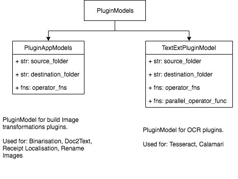

# VF Image Annotation Tool

Initial goal of this Annotation tool was to provide a simple annotation tool that can do the following

* A Image Annotation - Web tool (can run in local or over web for a group collaboration)
* Generation of XML-annotation file for each image file

As the growth continued, we added following image features to it.

* Fix rotation images
* Crop the image to user required size
* Automated Binarisation of images

Other pages

* A Summary page: To review how well the cropping & binarisation are working
* A Stats page: To know the statistics of on annotation completed

# History

Today, Image(document) Annotation has become of the important tool & job required for machine learning models to learn and try to predict. But as of 2019, we find only a limited number of tools that fit into out category that would help quickly annotated the image.

We have inspired from the works of `Image Annotation Programme` and wished to take forward, meeting our needs and increasing it capability by assisting users in their work.


# Project Development Page.

To know more the works in development, please check the following Project Page

[https://github.com/Imaginea/vitaFlow/projects/10](https://github.com/Imaginea/vitaFlow/projects/10)

## Experiment Feature

* TF Records Generation
* Support for HDFS files
* Support for Spark for image process/text extraction

# User Guide

## How to start Annotation Server

Please check for `requirement.txt` for installing required packages for Annotation Server.

```
$ pwd
vitaFlow/vitaflow/annotate_server

$ ~/anaconda3/bin/python vitaFlow/vitaflow/annotate_server/run.py
...
 * Running on http://127.0.0.1:5000/ (Press CTRL+C to quit)
...
```

This Annotation Server is developed in Python3 using Flask. 

## How to Cropper Image

After starting Annotation server, while Annotating Images - Cropper Option is show to crop that specific Image.

Cropper has very versatile set of rotation and crop option.

## Functionality - How the folder structure is

Annotation Tool is build with a flexible design to keep adding features as well as scalable.

For example, `binarisation`, `receipt localisation` and `image_to_text` features are added as an option feature but can run seperately with out whole pipeline or can be hosted as a micro-service.

- Folder: Image(Core): Location for storing images required to be annotated.
- Folder: Cropper(Optional): Location where cropped images are stored.
- Folder: Binarisation(Core): Location where cropped and gray scaled images are stored.
- Folder: Annotation(Core): Location where one can find .xml files.

## How to use existing ML/DL Models to auto tag images

WIP

## Workflow for doing OCR


__1. Receipt Localisation / Document Orientation__

Option 1: Add images & east-text files to `static/data/east`

    python receipt_localisation.py

Option 2: Add images & east-text files to `static/data/preprocess`

    python doc2text.py

In both cases, the output shall be stored to `static/data/images`

__1.1. Rename Files__

For some images it is possible to contain space, dots and other non ascii charecter in the image name. To fix this issues, once case following.

    python rename_imagefiles.py

It is expected that files in `static/data/images`. As the name says, all image files are only rename and not moved.

__2. Binarise images/ Text Cleaner__

        python binarisation.py

It's expected that input images are in `static/data/images` and the output shall be stored to `static/data/binarisation`

__3. Convert bineraise images to Text-Lines__

        python image_to_textlines.py

It's expected that input images are in `static/data/binarisation` and the output shall be stored to `static/data/text_images`

__4. OCR__

All input files are expected to be in `static/data/text_images`

Option 1: For Tessaract OCR

        python ocr.py

Output files will to generated to `static/data/text_data`

Option 2: For Calamari OCR

        python calamari_ocr.py

Output files will to generated to same location where images are

## Developer Guide



All the above script follow two plugin architectures defined in 'annotation_server.bin.plugin'

1. Plugin for files(images) processing
2. Plugin for OCR

Features provided with these plugins

1. Execution: Based on preference, one can do step by step transformation as well as bulk processing
2. Exception Handling wrapper
3. 

For adding a new plugin following are required

1. Every plugin is takes 3 inputs
    1. _transformation function_ that is expected to take two inputs - source_file, destination_file.
    2. _source folder_
    3. _destination folder_
2. Its expected that _transformation function_ can handle if `None` if given as destination_file


# Project Dashboard

* https://github.com/Imaginea/vitaFlow/projects/10
* https://github.com/Imaginea/vitaFlow/projects/8

# References

* https://github.com/frederictost/images_annotation_programme
* https://fengyuanchen.github.io/cropperjs/
* http://www.fmwconcepts.com/imagemagick/textcleaner/
* https://imagemagick.org
* https://docs.opencv.org/3.0-beta/doc/py_tutorials/py_tutorials.html
* https://github.com/tesseract-ocr/tesseract
* https://github.com/Calamari-OCR/calamari

