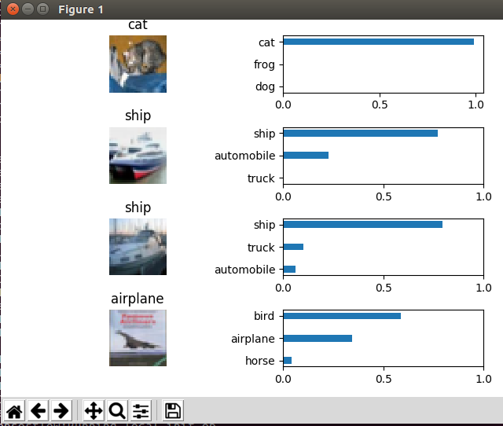

# [Cifar10 Dataset](https://www.cs.toronto.edu/~kriz/cifar.html)

The CIFAR-10 dataset consists of 60000 32x32 colour images in 10 classes, with 6000 images per class. 
There are 50000 training images and 10000 test images. 

## Iterators
- Basic Iterator
    A simple iterator which when configured will give batches of images and corresponding one-hot encoded
    labels
- GAN Iterator
    Gives batches of images, noise vector and one-hot encoded labels

## Models
- Classifier
    - [Naive Convolutional Network](https://papers.nips.cc/paper/4824-imagenet-classification-with-deep-convolutional-neural-networks.pdf)
- GANS
    - Vanilla GAN
    - [CGAN](https://arxiv.org/abs/1411.1784)
    - [BEGAN](https://arxiv.org/abs/1703.10717)
    
## How to run:

**GANS**
```
python vitaflow/bin/run_experiments.py --config_python_file=examples/cifar10/gan_config.py --mode=train
#By default the generator images are logged under ~/vitaflow/runtime/model_name/
```

**Classifier**
```
python vitaflow/bin/run_experiments.py --config=vitaflow/playground/cifar10/classifier_config.gin --mode=train
# for now it takes first 4 images and predicts based in the trained model
python vitaflow/bin/run_experiments.py --config_python_file=examples/cifar10/classifier_config.py --mode=predict
```




### TODO update with all the details